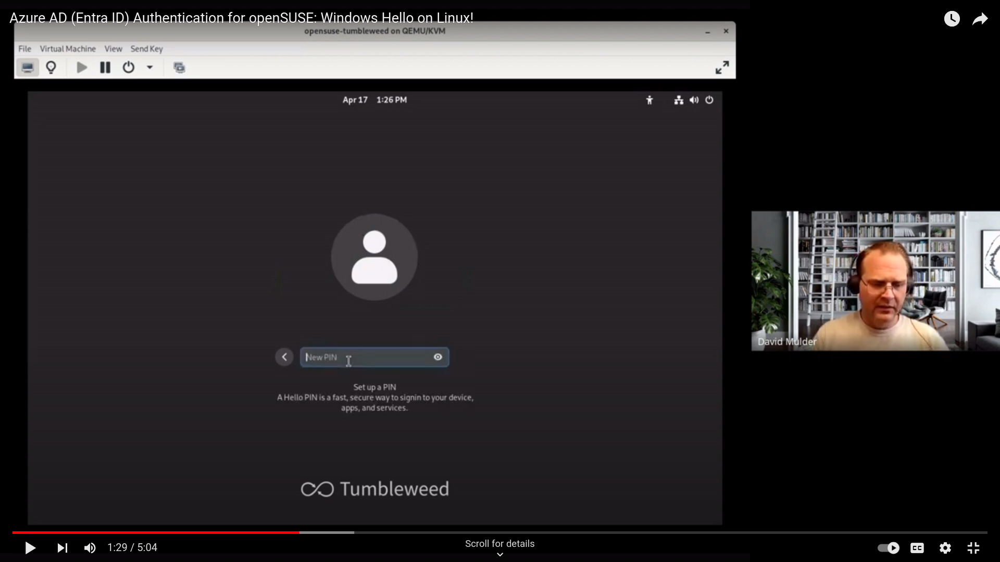
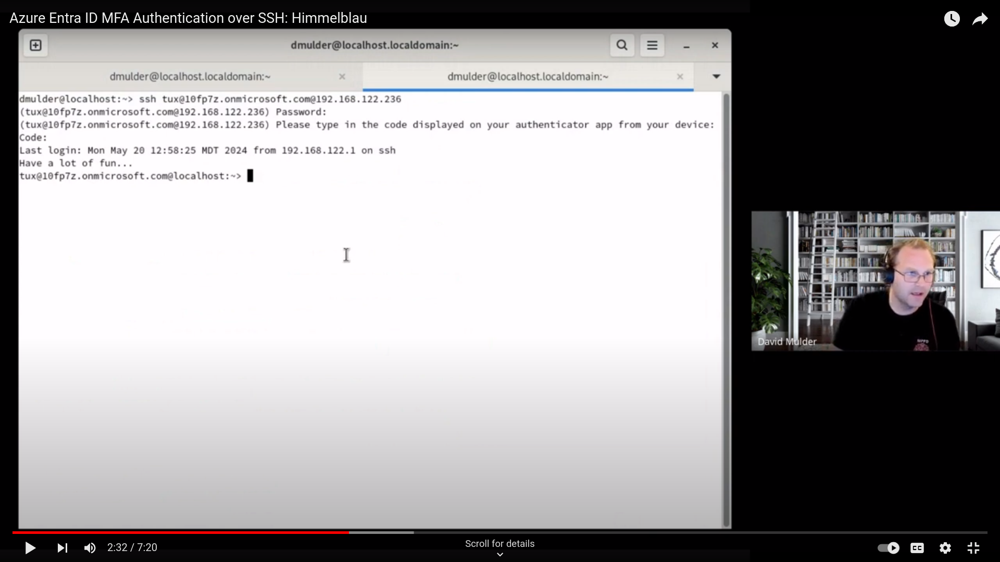

# Himmelblau

<p align="center">
  
</p>

Himmelblau is an interoperability suite for Microsoft Azure Entra ID and Intune.

The name of the project comes from a German word for Azure (sky blue).

Himmelblau supports Linux authentication to Microsoft Azure Entra ID via PAM and NSS modules.
The PAM and NSS modules communicate with Entra ID via the himmelblaud daemon. Himmelblau plans to
enforce Intune MDM policies, but this work isn't completed yet.

[](https://www.youtube.com/watch?v=G07FTKoNTRA "sambaXP 2024: Bridging Worlds – Linux and Azure AD")

## Contact

You can reach out on the [Himmelblau community matrix channel](https://matrix.to/#/#himmelblau:matrix.org)
or on the [Samba Technical community matrix channel](https://matrix.to/#/#samba-technical:matrix.org).

## Donations

Himmelblau is a Samba Team project. The core libraries used in Himmelblau are being developed for use
in Winbind. In fact, Himmelblau is simply the [Kanidm unix client](https://github.com/kanidm/kanidm)
utilizing the Winbind libraries written for Azure Entra ID. If you would like to make
[financial contributions](https://www.samba.org/samba/donations.html) to this project, please make your
donations to the Samba Team.

## Installing

Himmelblau is currently only being built on openSUSE. Packaging contributions are welcome!

On openSUSE Tumbleweed, refresh the repos and install himmelblau:

```shell
sudo zypper ref && sudo zypper in himmelblau nss-himmelblau pam-himmelblau
```

On openSUSE Leap and SUSE Linux Enterprise, first add the experimental repo:

```shell
# For Leap 15.6 or SUSE Linux Enterprise 15 SP6:
sudo zypper ar https://download.opensuse.org/repositories/network:/idm/15.6/network:idm.repo
# For Leap 15.5 or SUSE Linux Enterprise 15 SP5:
sudo zypper ar https://download.opensuse.org/repositories/network:/idm/15.5/network:idm.repo
# For Leap 15.4 or SUSE Linux Enterprise 15 SP4:
sudo zypper ar https://download.opensuse.org/repositories/network:/idm/15.4/network:idm.repo
```

Then refresh the repos and install himmelblau:

```shell
sudo zypper ref && sudo zypper in himmelblau nss-himmelblau pam-himmelblau
```

## Demos

### Windows Hello on Linux via GDM
[](https://www.youtube.com/watch?v=rSeHxs0JX58 "Azure Entra ID Authentication for openSUSE: Windows Hello on Linux!")

### MFA Authentication over SSH

[](https://www.youtube.com/watch?v=IAqC8FoYLGc "Azure Entra ID MFA Authentication over SSH: Himmelblau")

## Contributing

The following packages are required on openSUSE to build and test this package.

    sudo zypper in make cargo git gcc sqlite3-devel libopenssl-3-devel pam-devel libcap-devel libtalloc-devel libtevent-devel libldb-devel libdhash-devel krb5-devel pcre2-devel libclang13 autoconf make automake  gettext-tools clang dbus-1-devel utf8proc-devel


Or on Debian based systems:

    sudo apt-get install make gcc libpam0g-dev libudev-dev libssl-dev pkg-config tpm-udev libtss2-dev libcap-dev libtalloc-dev libtevent-dev libldb-dev libdhash-dev libkrb5-dev libpcre2-dev libclang-18-dev autoconf gettext libsqlite3-dev build-essentials libdbus-1-dev libutf8proc-dev
    
    curl --proto '=https' --tlsv1.2 -sSf https://sh.rustup.rs | sh
    source "$HOME/.cargo/env"
    rustup default stable

On Debian systems, rust must be installed using [rustup](https://rustup.rs), because the version of Rust shipped with Debian is very old. The package `build-essentials` may not be available. Ignore this requirement if not found.

You can build the components with

    cd himmelblau; make

Install the binaries

> **WARNING** you should only do this on a disposable machine or a machine you are willing to
> recover with single user mode.

    sudo make install

Configure your instance

    vim /etc/himmelblau/himmelblau.conf

It's essential that you configure the `domains` and `pam_allow_groups` options, otherwise
no users will be able to authenticate. These options designate the list of domains and users
or groups which are allowed access to the host.

Run the daemon with:

    sudo systemctl start himmelblaud himmelblaud-tasks

Check systemd journal for errors.

Disable nscd

    systemctl stop nscd
    systemctl disable nscd
    systemctl mask nscd

Setup NSS

    cp /usr/etc/nsswitch.conf /etc/nsswitch.conf

    # vim /etc/nsswitch.conf
    passwd:     compat systemd himmelblau
    group:      compat systemd himmelblau
    shadow:     compat systemd himmelblau

Check that you can resolve a user with

    getent passwd <name>

Setup PAM

> **WARNING** only modify your PAM configuration if you are confident you understand
> the syntax. The following setup is meant as an example. Removing PAM modules from
> your stack may prevent you from authenticating to the host. Proceed with caution!

    old /etc/pam.d/{common-account,common-auth,common-password,common-session}
    cp /etc/pam.d/common-password-pc /etc/pam.d/common-password
    cp /etc/pam.d/common-auth-pc /etc/pam.d/common-auth
    cp /etc/pam.d/common-account-pc /etc/pam.d/common-account
    cp /etc/pam.d/common-session-pc /etc/pam.d/common-session

    # vim /etc/pam.d/common-auth
    auth        required      pam_env.so
    auth        [default=1 ignore=ignore success=ok] pam_localuser.so
    auth        sufficient    pam_unix.so nullok try_first_pass
    auth        sufficient    pam_himmelblau.so ignore_unknown_user
    auth        required      pam_deny.so

    # vim /etc/pam.d/common-account
    account    [default=1 ignore=ignore success=ok] pam_localuser.so
    account    sufficient    pam_unix.so
    account    sufficient    pam_himmelblau.so ignore_unknown_user
    account    required      pam_deny.so

    # vim /etc/pam.d/common-session
    session optional    pam_systemd.so
    session required    pam_limits.so
    session optional    pam_unix.so try_first_pass
    session optional    pam_umask.so
    session optional    pam_himmelblau.so
    session optional    pam_env.so

